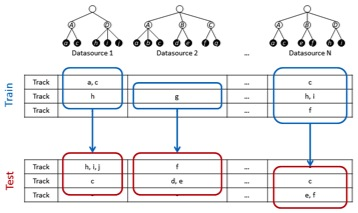
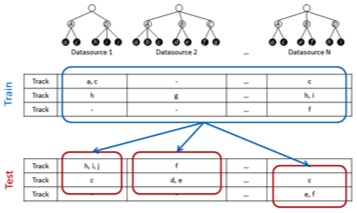

# AcousticBrainz Genre Task 2017: Content-based music genre recognition from multiple sources
## Announcements
- May 11: It took us extra time to process and organize our very large amounts of data. We are almost ready to release development and test datasets within a few days!

## Task schedule
- **Development and test datasets released on May 18, 2017**
- June: Release of a baseline approach
- May-Mid-August: Work on algorithms
- Mid-August: Submit runs
    - 14 August: Run submission
    - 21 August: Results returned to participants
- Early September: Working notes paper due
- 13-15 September MediaEval 2017 Workshop in Dublin
 
## Task description
This task invites participants to **predict genre and subgenre of unknown music recordings (songs) given automatically computed features of those recordings**. We provide a training set of such audio features taken from the [AcousticBrainz](http://acousticbrainz.org/) database [1] together with **four different ground truths of genre and subgenre labels**. These genre datasets were created using as a source four different music metadata websites. Their genre taxonomies vary in class spaces, specificity and breadth. Each source has its own definition for its genre labels meaning that these labels may be different between sources. Participants must train model(s) using this data and then generate predictions of genre and subgenre labels for a test set.

We provide a dataset (a development and test set) for every genre ground truth. In total, participants will be given four development datasets and all proposed models will be evaluated on four test datasets. **The goal is to create a system that uses provided music features as an input and predicts genre and subgenre labels, following genre taxonomy of each ground truth.**

Importantly, annotations in the datasets are multi-label. **There may be multiple genre and subgenre annotations for the same music recording.** It is guaranteed that each recording has at least one genre label, while subgenres are not always present.

The task includes two subtasks:

- **Subtask 1: consider each genre ground truth individually** to generate predictions for the four test datasets. This subtask will serve as a baseline for Subtask 2.
- **Subtask 2: combine genre ground truths together** to generate predictions for the four test datasets.

Participants are expected to create models and submit their predictions for both subtasks. In the case they only want to work on Subtask 1, the same predictions will be used for evaluation in the Subtask 2. 

Below is a detailed description of the subtasks.

**Subtask 1: Single-source Classification.** 
This subtask will explore conventional systems, each one trained on a single dataset. Participants will submit predictions for the test set of each dataset separately, following their respective class spaces (genres and subgenres). These predictions will be produced by a separate system for each dataset, trained without any information from the other sources.



**Subtask 2: Multi-source Classification.**
This subtask will explore how to combine several ground-truth sources to create a classification system. We will use the same four test sets. Participants will submit predictions for each test set separately, again following each corresponding genre class space. These predictions may be produced by a single system for all datasets or by one system for each dataset. Participants are free to make their own decision about how to combine the training data from all sources.




## Data
### Genre annotations
We provide four datasets containing genre and subgenre annotations extracted from four different online metadata sources. 

Two datasets (**AllMusic** and **Discogs**) are based on editorial metadata databases maintained by music experts and enthusiasts. These sources contain explicit genre/subgenre annotations of music releases (albums) following a predefined genre namespace and taxonomy. We propagated release-level annotations to recordings (tracks) in AcousticBrainz to build the datasets. 

The other two datasets (**Lastfm** and **Tagtraum**) are based on collaborative music tagging platforms with large amounts of genre labels provided by their users for music recordings (tracks). We have automatically inferred a genre/subgenre taxonomy and annotations from these labels following the algorithm proposed in [3] and a manual post-processing.

All four training genre datasets are distributed as TSV files with the following format: 
```
[RecordingID] [ReleaseGroupID] [genre/subgenre label] [genre/subgenre label] ...
```

A real data example:
```
4d7ec57e-e0fa-42be-be93-592bcba9fe2b    3518b072-a066-41b6-b7f1-d8e66b04880f    metal   metal---heavymetal      metal---progressivemetal        rock    rock---progressiverock
73274526-a840-4a51-b496-09fb94bf9360    b06eb8c1-4fae-4034-9a22-64fb2b37166f    country country---countryfolk   folk
1a09500c-5a08-4381-9fcb-cb8ef0aed520    55a0b305-29a2-4120-99d6-2edca519cc8d    soul
71a96555-5cd7-4062-9570-fb1921bab2f9    c6f1ff2d-d295-4f28-9161-559c3370cec9    pop     pop---ballad
728f0f0e-1b7c-487a-ad0b-f5888d637ac6    1199fd4e-4125-45f0-88a5-2865c9d10a20    electronic      electronic---ambient    instrumental    rock    rock---spacerock
```

Each line corresponds to one [recording](https://musicbrainz.org/doc/Recording) (a music track or song), and contains all its ground-truth genre and subgenre labels. `RecordingID` is the [MusicBrainz identifier](https://musicbrainz.org/doc/MusicBrainz_Identifier) of the particular recording. To distinguish between genre and subgenre labels, subgenre strings are compound and contain ```---``` as a separator between a parent genre and an actual subgenre name. For example, ```rock```, ```electronic```, ```jazz``` and ```hip hop``` are genres, while ```electronic---ambient```, ```rock---singersongwriter``` and ```jazz---latinjazz``` are subgenres. 

Additionally, we provide `ReleaseGroupID` for each recording, which is a MusicBrainz identifier of a [release group](https://musicbrainz.org/doc/Release_Group) (an album, single, or compilation) it belongs to. This data may be useful if one wants to avoid an "album effect" [4], which consists in potential overestimation of the performance of a classifier when a test set contains music recordings from the same albums as the training set.


### Music features
We provide a dataset of music features precomputed from audio for every music recording. The dataset can be downloaded as an archive. It contains a JSON file with music features for every `RecordingID`. See an [example JSON file](http://acousticbrainz.org/a3b8950a-d1f8-49b9-b88f-89f38726f332/low-level/view?n=0).

All music features are taken from the community-built database [AcousticBrainz](http://acousticbrainz.org) and were extracted from audio using [Essentia](http://essentia.upf.edu), an open-source library for music audio analysis [2].
They are grouped into categories (low-level, rhythm, and tonal) and are [explained in detail here](http://essentia.upf.edu/documentation/streaming_extractor_music.html#music-descriptors). Only statistical characterization of time frames is provided (bag of features), no frame-level data is available.

 
### Development and Test Data
The **development data** contains:

- **music features for all recordings** in AllMusic, Discogs, Lastfm and Tagtraum datasets (~30GB bz2 archives, 83GB uncompressed JSON files). Each filename corresponds to a ``RecordingID`` (which is a [UUID](https://en.wikipedia.org/wiki/Universally_unique_identifier)). They are split into 8 separate archives according to the first hex digits of their RecordingIDs.
 - Because there is substantial overlap between the Recordings in each dataset, we provide a single series of archives which contain data for all datasets.
 - All archives will uncompress into a directory named `acousticbrainz-mediaeval-train`. Data files are named in the form `54/54551aad-fb76-4e22-8725-fd495c32b155.json`, where the file is inside a subdirectory named by the first two letters of its RecordingId.
 - You may find that the data files have a value in the `metadata.tags.musicbrainz_recordingid` field which is different to the RecordingID used in the filename. [This is to be expected due to Musicbrainz ID redirects](https://musicbrainz.org/doc/MusicBrainz_Identifier).
- **four archives with ground-truth genre annotations** (AllMusic, Discogs, Lastfm, Tagtraum - see format description above)

The **test data** contains **four archives of music features for recordings with anonymized RecordingIDs**. To avoid a potential album effect [4], no recording in the test set contains music from the same release groups as the recordings in the train set.
- Although RecordingIDs are UUIDs, they have been randomly anonymised and do not correspond to any MusicBrainz IDs on musicbrainz.org

All data is compressed with bzip2. Checksums are provided to ensure that you have correctly downloaded the archives.

The development and test data for Discogs, Lastfm and Tagtraum is publicly available [here](https://drive.google.com/open?id=0B8wz5KkuLnI3RjFYSFY5TkJVU1U)

The development data (genre ground truth) and test data for AllMusic requires signing the **Data Usage agreement** by participants. The data will be shared to the participants in personal communication (please, ask the organizers).


### Notes

Note that the data we provide is very large-scale. It includes a large number of music recordings and many of music features for those recordings. Participants are free to use all of the data to train their systems or only its part.

Please, contact the organizers if you have further questions or need help. 

 
## Run submission

Participants are expected to submit predictions for both subtasks. **If they only want to work on the first subtask, they should submit the same predictions for the second subtask**. We allow only five evaluation runs (each run includes both subtasks). In every single run, participants should submit predictions for both Subtask1 and Subtask2 in two separate files. 

Submission format: 

Each submission should include three or four TSV files for Subtask1 (one file for each test dataset, only provide three if you are not using AllMusic data) and three or four TSV files for Subtask2. Submissions should follow a format similar to the ground truth format (see Data section):

```
[RecordingID] [genre/subgenre label] [genre/subgenre label] ...
```

Each line corresponds to an anonymized RecordingID from a test dataset and should **include explicitly all predicted genre and subgenre labels**. 

Participants can ensure their submission format is correct running the provided evaluation script (**to be announced in June**). 

Participants should report whether they used the whole development dataset or only its part for every submission.

## Evaluation Methodology

The evaluation will be carried out for each dataset separately. In particular, we will compute precision, recall and F-score as follows:

* Per recording, only genre labels.
* Per recording, only subgenre labels.
* Per recording, all labels.
* Per label, all recordings.  

Note that the ground truth does not necessarily contain subgenre annotations for some recordings. Therefore, only recordings containing subgenres will be considered for the evaluation on the subgenre level.

An evaluation script is provided for development: (**to be announced in mid-May**). 
 
## Working Notes and Overview Paper
Please follow the general instructions for the working notes paper. Remember to cite the task overview paper in your working notes paper. A draft version of that paper is available here: <Link to be added when the test data is released>
 
## Recommended Reading
[1] Porter, A., Bogdanov, D., Kaye, R., Tsukanov, R., Serra, X. Acousticbrainz: a community platform for gathering music information obtained from audio. In Proceedings of the 16th International Society for Music Information Retrieval Conference. Málaga, Spain, 2015, 786-792.

[2] Bogdanov, D., Wack, N., Gómez, E., Gulati, S., Herrera, P., Mayor, O., Roma, G., Salamon, J., Zapata, J., Serra, X. ESSENTIA: an audio analysis library for music information retrieval. In Proceedings of the 14th International Society for Music Information Retrieval Conference. Curitiba, Brazil, 2013, 493-498.

[3] Schreiber, H. Improving genre annotations for the million song dataset. In Proceedings of the 16th International Society for Music Information Retrieval Conference. Málaga, Spain, 2015, 242-247.

[4] Flexer, A., & Schnitzer, D. (2009). Album and Artist Effects for Audio Similarity at the Scale of the Web. In Proceedings of the 6th Sound and Music Computing Conference. Porto, Portugal.

[5] Porter, A., Bogdanov, D., Serra, X. Mining metadata from the web for AcousticBrainz. In Proceedings of the 3rd International workshop on Digital Libraries for Musicology. New York, USA, 2016, 53-56. ACM.

[6] Pachet, F., & Cazaly, D. A taxonomy of musical genres. In Content-Based Multimedia Information Access, RIAO 2000, volume 2, 1238-1245. 


## Task Organizers
- Dmitry Bogdanov, Music Technology Group, Universitat Pompeu Fabra, Spain (first.last @upf.edu)
- Alastair Porter, Music Technology Group, Universitat Pompeu Fabra, Spain (first.last @upf.edu)
- Julián Urbano, Multimedia Computing Group,  Delft University of Technology, Netherlands
- Hendrik Schreiber, Tagtraum Industries Incorporated, USA 


## Acknowledgments
[AcousticBrainz](https://acousticbrainz.org/), [Audio Commons](http://audiocommons.org/) and [Tagtraum](http://www.tagtraum.com/)


This research has received funding from the European Union's Horizon 2020 research and innovation programme under grant agreement No 688382.
