# Results

The final submissions are (115 runs):

* `baseline` (8 runs): 2 runs for task1 on all 4 datasets.
* `dbis` [pdf](papers/dbis-2017.pdf) (40 runs): 5 runs for task1 and 5 runs for task2 on all 4 datasets.
* `icsi` [pdf](papers/icsi-2017.pdf) (15 runs): 5 runs for task1 on 3 datasets (no `allmusic`).
* `jku` [pdf](papers/jku-2017.pdf) (32 runs): 3 runs for task1 and 5 runs for task2 on all 4 datasets.
* `kart` [pdf](papers/kart-2017.pdf) (16 runs): 4 runs for task1 on all 4 datasets.
* `samirit` [pdf](papers/samirit-2017.pdf)(4 runs): 1 run for task1 on all 4 datasets.

For the baseline:

* `run1` is random, following the distribution of labels found in the development sets.
* `run2` always predicts the most popular genre in the development set.

The solid grey lines mark the performance of the random baseline, and the dotted lines mark the performance of the popularity-based baseline. The numbers indicate whether the run belongs to task1 or task2.

All results are also available in a [CSV file](allscores.csv). 

See the complete MediaEval2017 procedings including the working note papers for all submissions [here](http://ceur-ws.org/Vol-1984/). 

## Per-track average scores
### Per-track Precision vs Recall for all labels

 

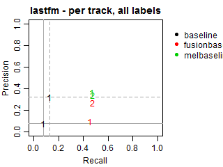 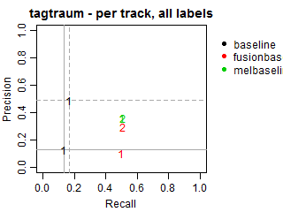

### Per-track Precision vs Recall for genre labels

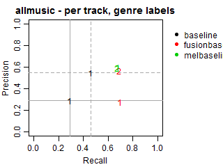 

 

### Per-track Precision vs Recall for subgenre labels

 

 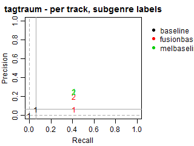

## Per-label average scores
### Per-label Precision vs Recall for all labels

 

 

### Per-label Precision vs Recall for genre labels

 

 

### Per-label Precision vs Recall for subgenre labels

 

 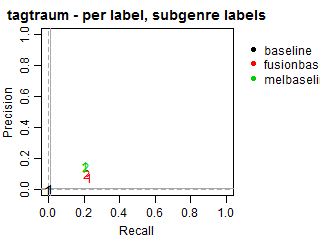

# Results adjusted by genre-subgenre hierarchies

The submissions to the task were required to include all predicted genres and subgenres explicitly. Therefore, we did not explicitly consider hierarchical relations in the evaluation.

We conducted an additional evaluation with an adjustment for such relations, because most submissions did not explicitly predict the genres of the predicted subgenres.
In these cases, we expanded all predictions to also include the corresponding genres, even if they were missing in the original submissions. Such correction may increase genre recall and alter precision, because more genres will be present in predictions, including relevant and irrelevant ones.
Note that the results at the subgenre label do not change.

The plots below demonstrate Precision, Recall and F-scores  with and without label expansion. The inspection of these results revealed no significant difference in performance. 
Recall changes very little, with the exception of ICSI. Still, its F-scores remain virtually the same due to the low precision.

All results are also available in a [CSV file](allscores2.csv). 

### Per-track F-score, Precision and Recall 

 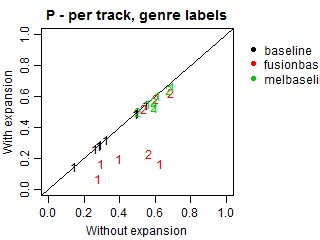 

 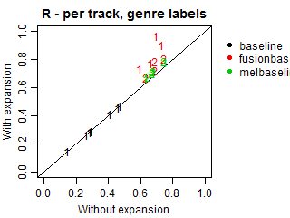 

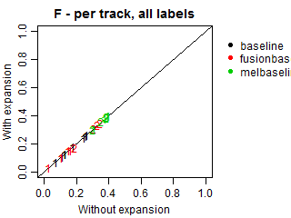 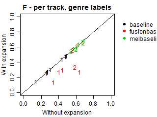 

### Per-label F-score, Precision and Recall

 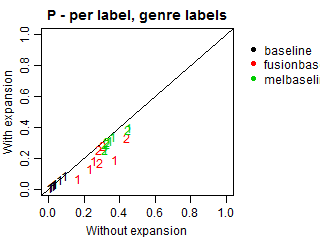 

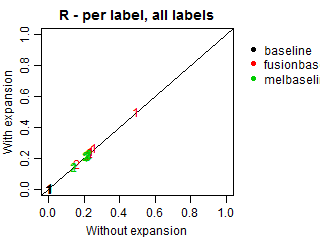  

 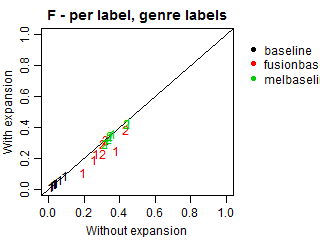 

