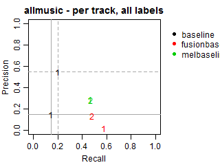
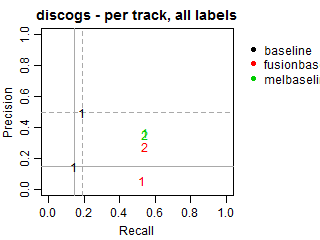
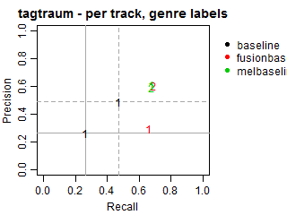
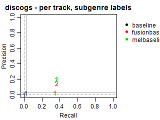
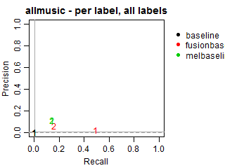
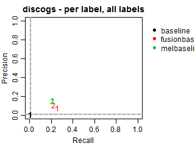
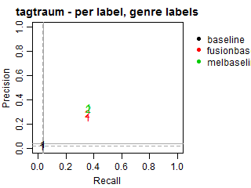

# Results

The final submissions are (115 runs):

* `baseline` (8 runs): 2 runs for task1 on all 4 datasets.
* `dbis` (40 runs): 5 runs for task1 and 5 runs for task2 on all 4 datasets.
* `icsi` (15 runs): 5 runs for task1 on 3 datasets (no `allmusic`).
* `jku` (32 runs): 3 runs for task1 and 5 runs for task2 on all 4 datasets.
* `kart` (16 runs): 4 runs for task1 on all 4 datasets.
* `samirit` (4 runs): 1 run for task1 on all 4 datasets.

For the baseline:

* `run1` is random, following the distribution of labels found in the development sets.
* `run2` always predicts the most popular genre in the development set.

The solid grey lines mark the performance of the random baseline, and the dotted lines mark the performance of the popularity-based baseline. The numbers indicate whether the run belongs to task1 or task2.

All results are also available in a [CSV file](allscores.csv). 

## Per-track average metrics
### Per-track Precision vs Recall for all labels

 

 

### Per-track Precision vs Recall for genre labels

 

 

### Per-track Precision vs Recall for subgenre labels

 

 

## Per-label average metrics
### Per-label Precision vs Recall for all labels

 

 

### Per-label Precision vs Recall for genre labels

 

 

### Per-label Precision vs Recall for subgenre labels

 

 

# Results adjusted by genre-subgenre hierarchies
The submissions to the task were required to include all predicted genres and subgenres explicitly. We, therefore, did not explicitly consider hierarchical relations between them in our main evaluation.

We conducted an additional evaluation with an adjustment for such relations, as we have found that the submissions did not necessary followed our requirement. To this end, for all predicted subgenres we also considered their parent genres as predicted even if these genres were missing in the original submissions. Such correction may increase genre recall and alter precision as more genres will be present in predictions, including relevant and irrelevant ones.

The inspection of these results revealed no significant difference in performance of the submitted systems. The plots below demonstrate F-score, precision and recall changes before/after adjustment.

The obtained results are very similar. Recall changes very little. The only observed significant difference was in the performance of ICSI, which got much more recall on genres after adjustment. Still, its precision was so low that the F-measure almost did not change.

### Per-track F-score, Precision and Recall for all labels
 
  

### Per-track F-score, Precision and Recall for genres
 
  

### Per-track F-score, Precision and Recall for subgenres
 
  

### Per-label F-score, Precision and Recall for all labels
 
  

### Per-label F-score, Precision and Recall for genres
 
  

### Per-label F-score, Precision and Recall for subgenres
 
  

# Conclusions

As this is our first year, we are still open to decide the future direction for the tasks. We, therefore, considered two options in evaluation:
- Evaluation ignoring hierarchical relations between genres and subgenres (main evaluation). This is suitable in the case we want systems to be able to predict broad-level genres and finer subgenres while we might be not sure in the appropriateness of the ground-truth genre hierarchies of our genre sources.
- Evaluation with hierarchy-based adjustment inferring parent genre for predicted subgenres in the case participants did not explicitly provide so.
